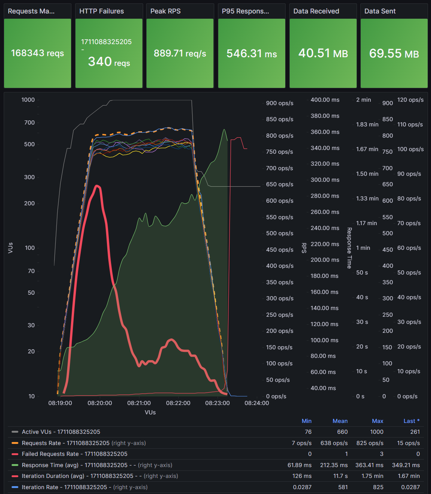
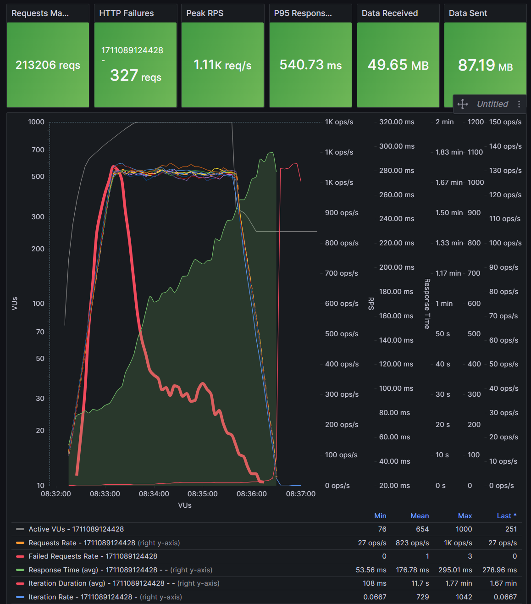
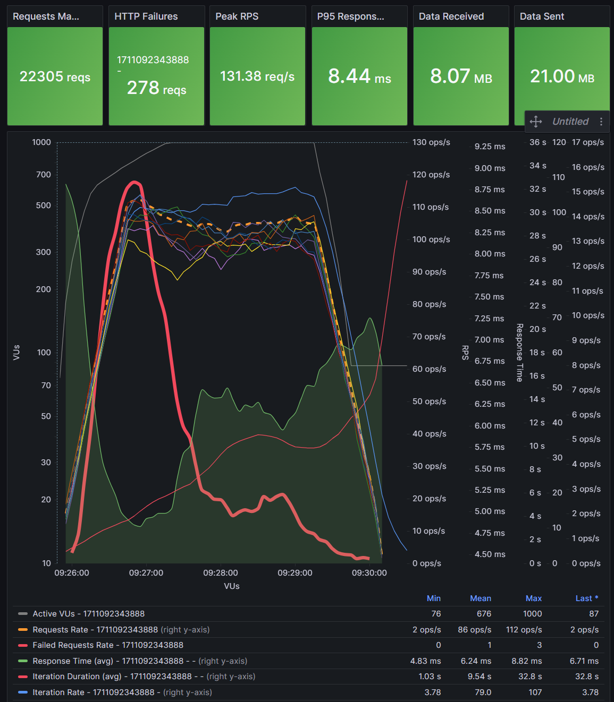
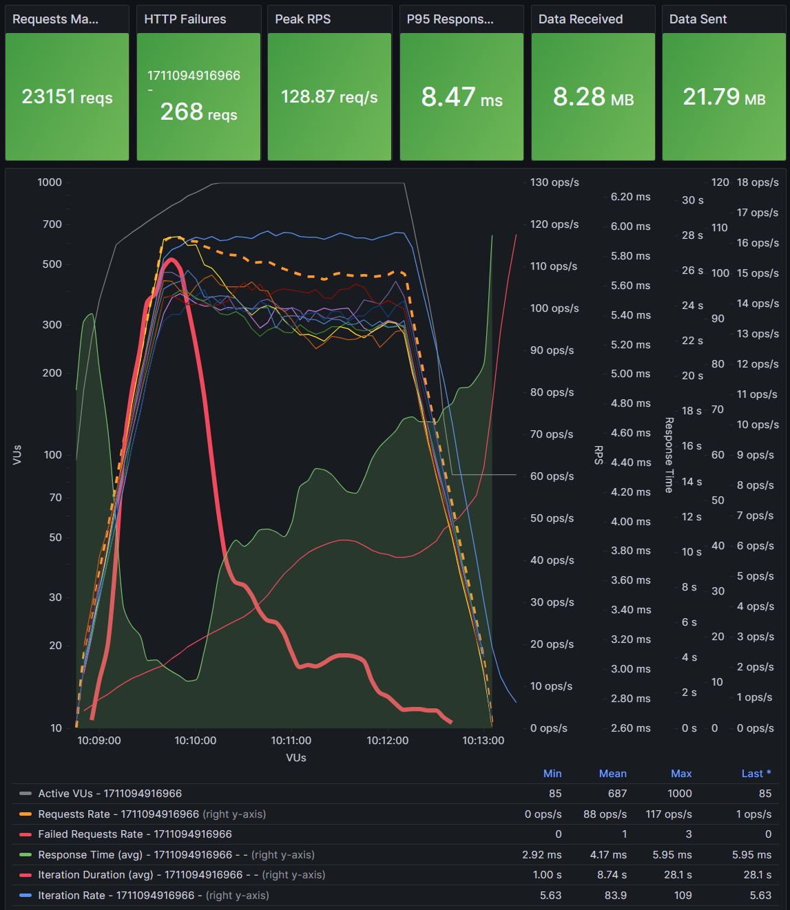
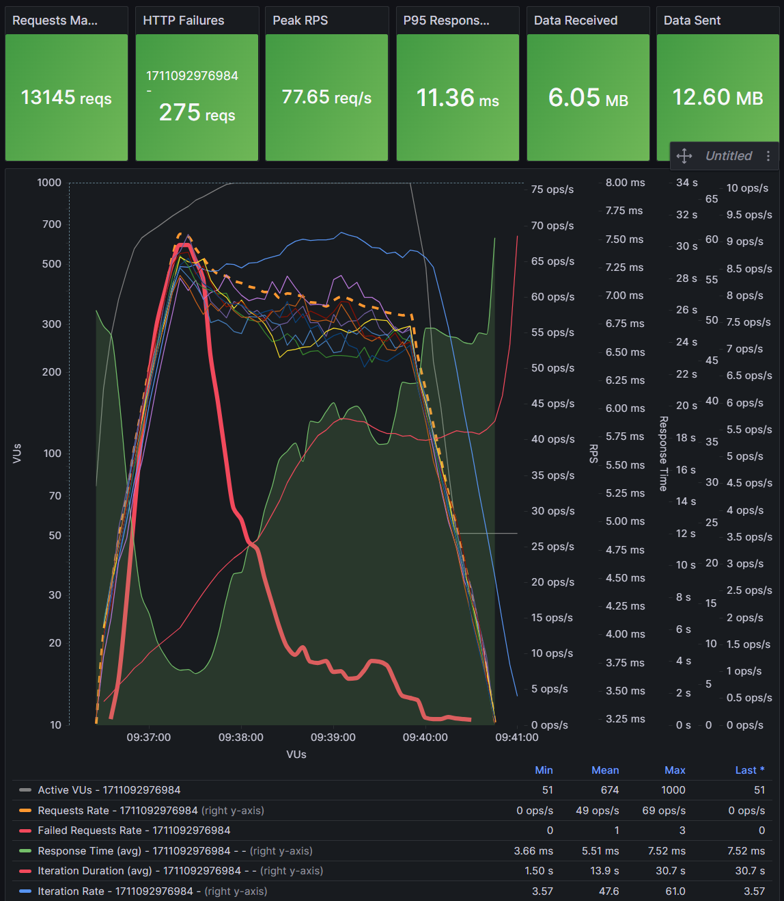
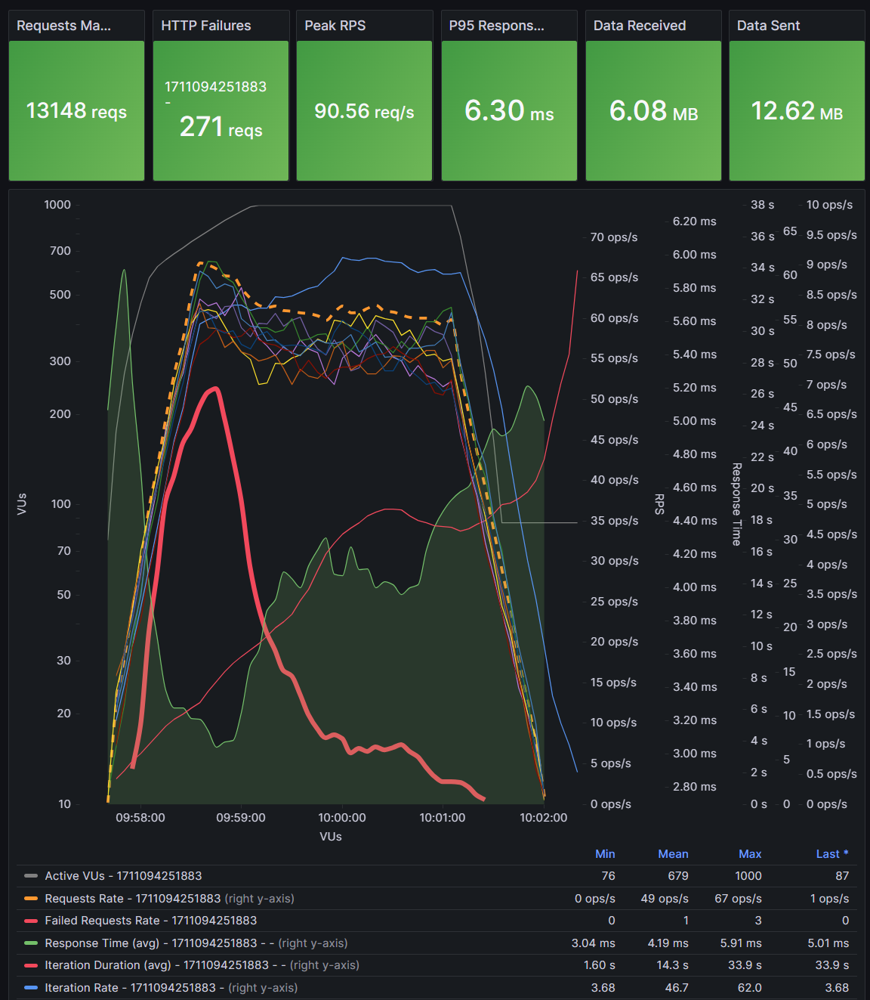
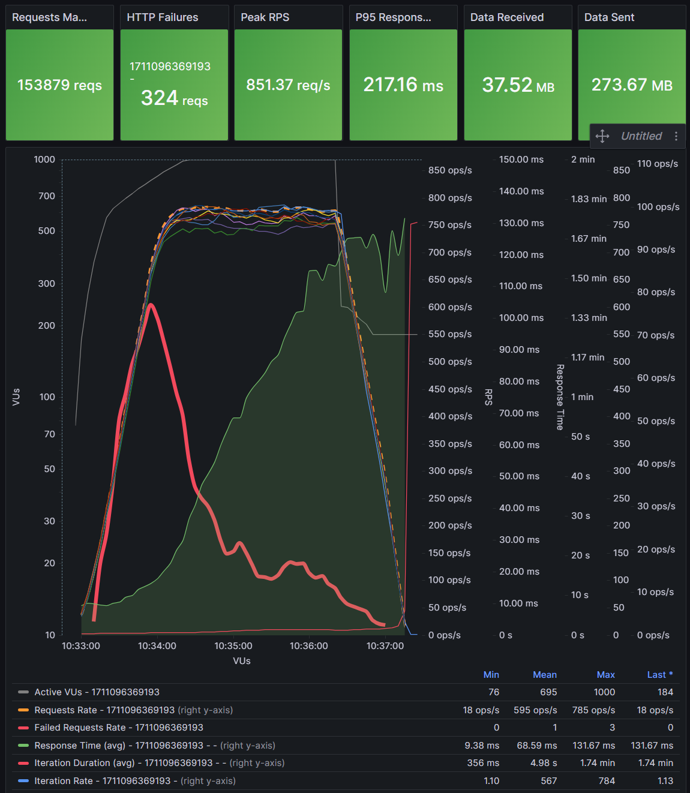
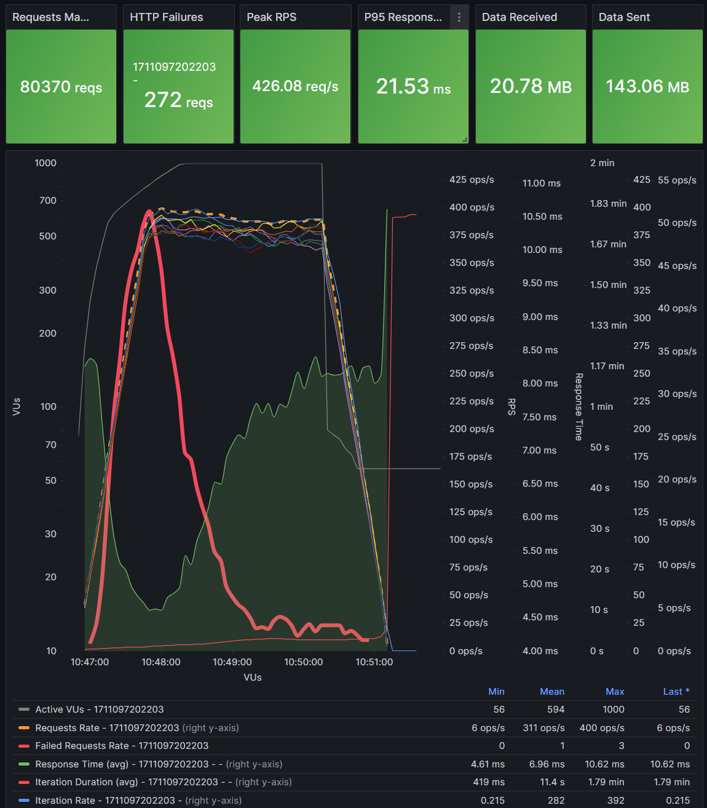
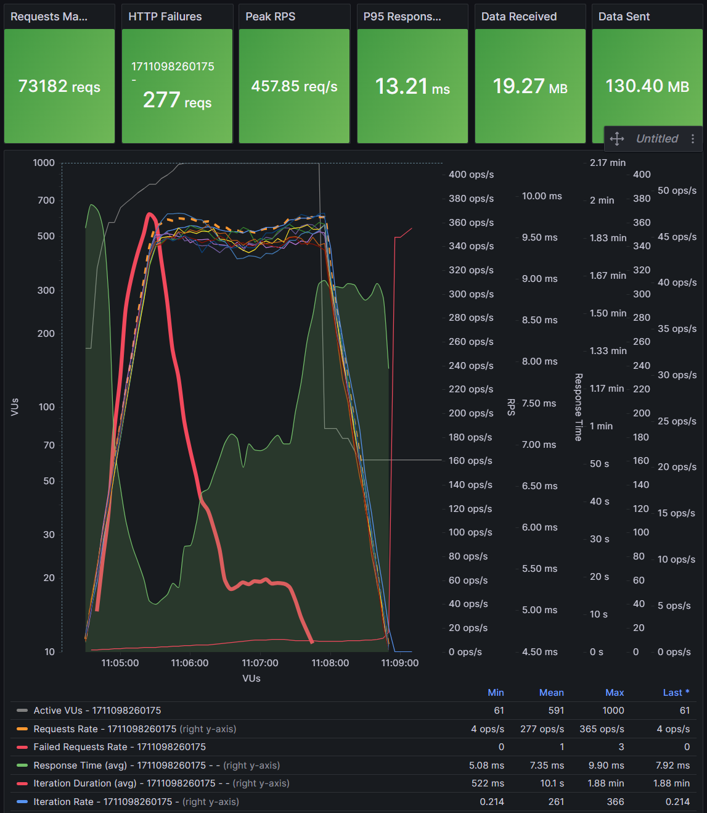

# Performance characterization report

All tests are performed with following config:

- VU ramping using K6 config:
    ```json
    {
        "executor": "ramping-vus",
        "startVUs": 5,
        "stages": [
            { "duration": "30s", "target": 600 },
            { "duration": "1m", "target": 1000 },
            { "duration": "2m", "target": 1000 }
        ]
    }
    ```
- `EVENT_SDK_LOG_FILTER` set to empty, to disable audit event logging in the console
- istio sidecar disabled in `moja-ml-api-adapter-handler-notification`
- `moja-centralledger-handler-transfer-fulfil` - 12 replicas
- `moja-centralledger-handler-transfer-prepare` - 12 replicas
- `moja-ml-api-adapter-handler-notification` - 12 replicas
- `moja-handler-pos-batch` - 8 replicas
- all related topics - 12 replicas, 1 replicas
- configuration changed for prepare and fulfill Kafka consumers:
  - `batchSize` = 3
  - `syncConcurrency` =  3
  - `syncSingleMessage` = true
  - `consumeTimeout` = 10

| test           | peak ops/sec  | screenshot                    | DB     | Sidecars      | notes                                                            |
| -------------- | ---------     | ----------                    | --     | --            | ------                                                           |
| Account lookup |   825         |   | disk   | enabled       |  8 x moja-account-lookup-service                                 |
| Account lookup |  1042         |  | disk   | enabled       | 12 x moja-account-lookup-service                                 |
| Quoting        |   107         |    | RAM    | enabled       | 12 x moja-quoting-service-handler, 12 x moja-quoting-service     |
| Quoting        |   109         |             | RAM    | disabled      | 12 x moja-quoting-service-handler, 12 x moja-quoting-service     |
| Quoting        |    61         |     | RAM    | enabled       |  6 x moja-quoting-service-handler,  6 x moja-quoting-service     |
| Quoting        |    62         |              | RAM    | disabled      |  6 x moja-quoting-service-handler,  6 x moja-quoting-service     |
| Transfer       |   784         |             | RAM    | disabled      | DB with ~2 million existing transfers                            |
| Transfer       |   392         |    | RAM    | pos-batch only| DB with ~2 million existing transfers                            |
| Transfer       |   366         |    | RAM    | enabled       | DB with ~2 million existing transfers                            |
