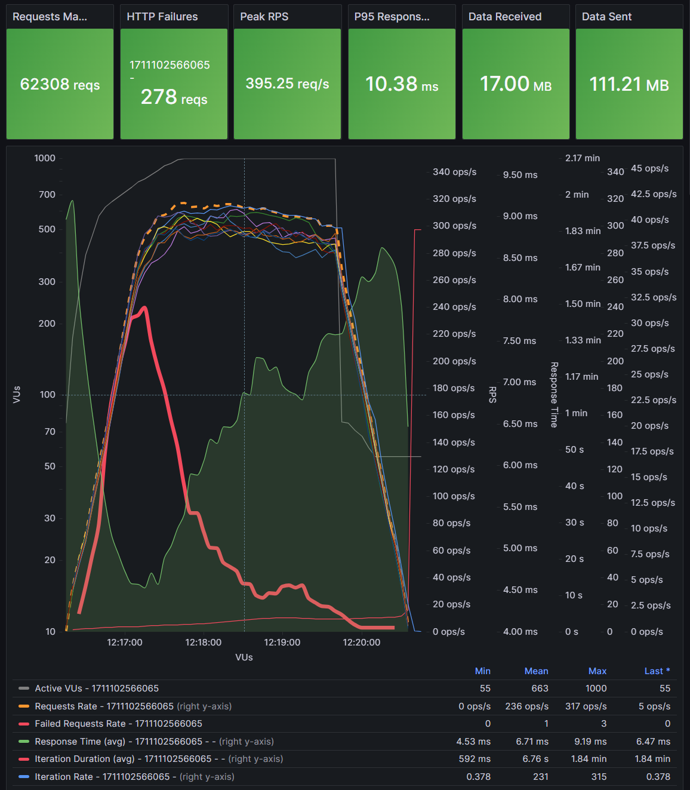
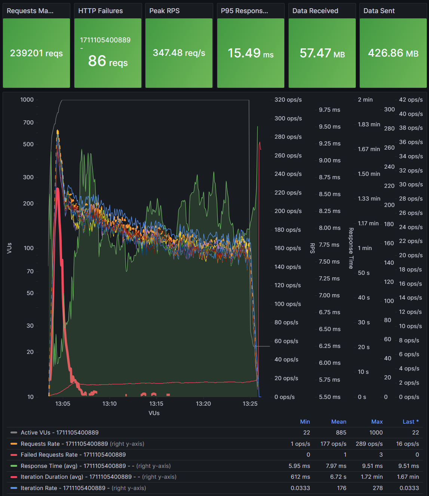
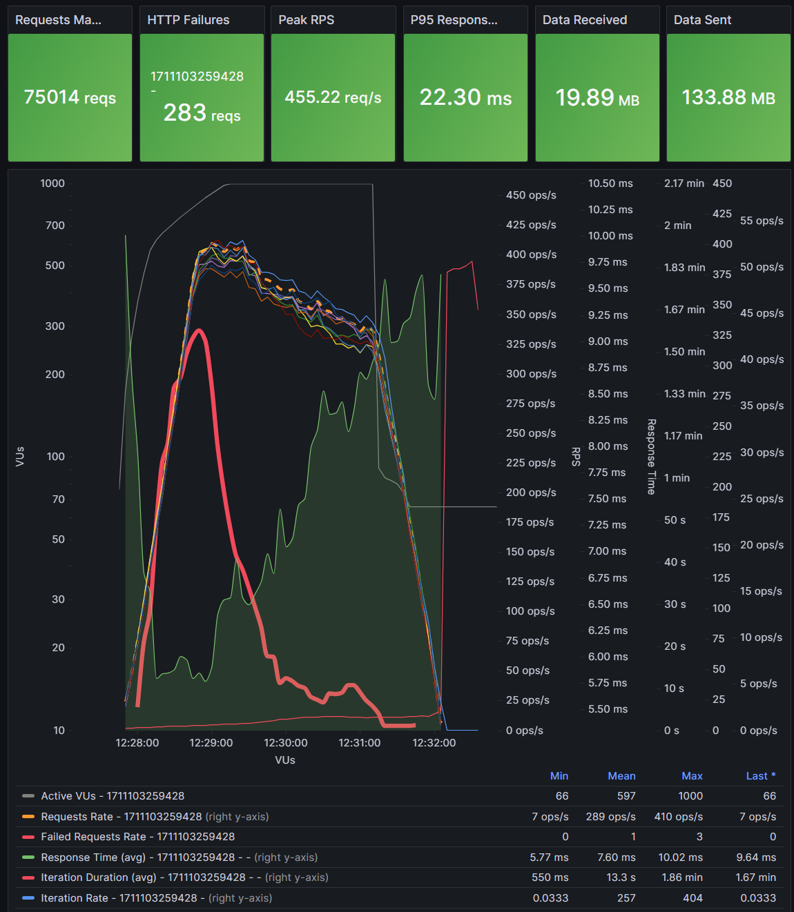
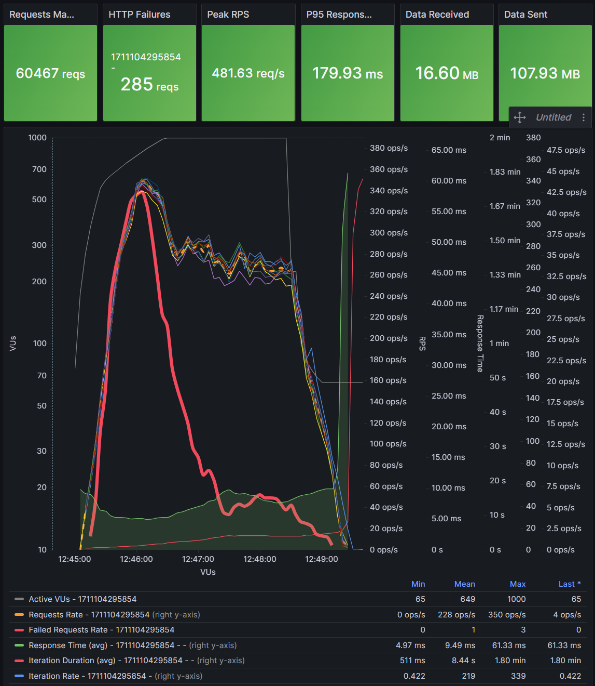
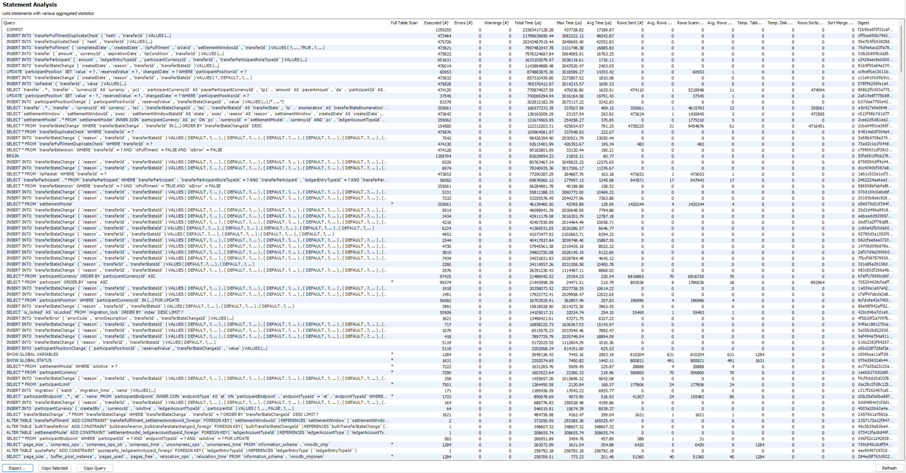

# Performance characterization report

All tests are performed with following config:

- VU ramping using K6 config:
    ```json
    {
        "executor": "ramping-vus",
        "startVUs": 5,
        "stages": [
            { "duration": "30s", "target": 600 },
            { "duration": "1m", "target": 1000 },
            { "duration": "2m", "target": 1000 }
        ]
    }
    ```
- `EVENT_SDK_LOG_FILTER` set to empty, to disable audit event logging in the console
- istio sidecar disabled in `moja-ml-api-adapter-handler-notification`
- `moja-centralledger-handler-transfer-fulfil` - 12 replicas
- `moja-centralledger-handler-transfer-prepare` - 12 replicas
- `moja-ml-api-adapter-handler-notification` - 12 replicas
- `moja-handler-pos-batch` - 8 replicas
- `innodb_buffer_pool_size` = 2147483648 (2GB)
- all related topics - 12 partitions, 1 replicas
- configuration changed for prepare and fulfill Kafka consumers:
  - `batchSize` = 3
  - `syncConcurrency` =  3
  - `syncSingleMessage` = true
  - `consumeTimeout` = 10

| test           | peak ops/sec  | screenshot                         | DB     | Sidecars           | notes                                                        |
| -------------- | ---------     | ----------                         | --     | --                 | ------                                                       |
| Account lookup |   825         |        | disk   | on                 |  8 x moja-account-lookup-service                             |
| Account lookup |  1042         |       | disk   | on                 | 12 x moja-account-lookup-service                             |
| Quoting        |   107         |         | RAM    | on                 | 12 x moja-quoting-service-handler, 12 x moja-quoting-service |
| Quoting        |   109         |                  | RAM    | off                | 12 x moja-quoting-service-handler, 12 x moja-quoting-service |
| Quoting        |    61         |          | RAM    | on                 |  6 x moja-quoting-service-handler,  6 x moja-quoting-service |
| Quoting        |    62         |                   | RAM    | off                |  6 x moja-quoting-service-handler,  6 x moja-quoting-service |
| Transfer       |   784         |                  | RAM    | off                | DB with ~2 million existing transfers                        |
| Transfer       |   392         |         | RAM    | on only pos-batch  | DB with ~2 million existing transfers                        |
| Transfer       |   366         |         | RAM    | on                 | DB with ~2 million existing transfers                        |
| Transfer       |   315         |  | Disk   | on                 | DB with 1K transfers                                         |
| Transfer       |   221 => 159  |   | Disk   | on                 | DB with 230K - 475K transfers, run for 20 minutes            |
| Transfer       |   404 => 336  |             | Disk   | off only pos-batch | DB with  60K - 140K transfers                                |
| Transfer       |   339 => 267  |            | Disk   | off                | DB with 140K - 200K transfers                                |

> [!NOTE]
>
> RAM DB is configured with the following settings in the `apps/mojaloop-stateful-resources/values-mysql-central-ledger-db.yaml`:
> ```yaml
> primary:
>   persistence:
>     enabled: false
>     extraVolumes:
>       - name: bitnami
>         emptyDir:
>           medium: Memory
>     extraVolumeMounts:
>       - name: bitnami
>         mountPath: /bitnami/mysql/data
> ```

> [!NOTE]
>
> SQL Query analysis - Disk DB, after 475K transfers
> 
