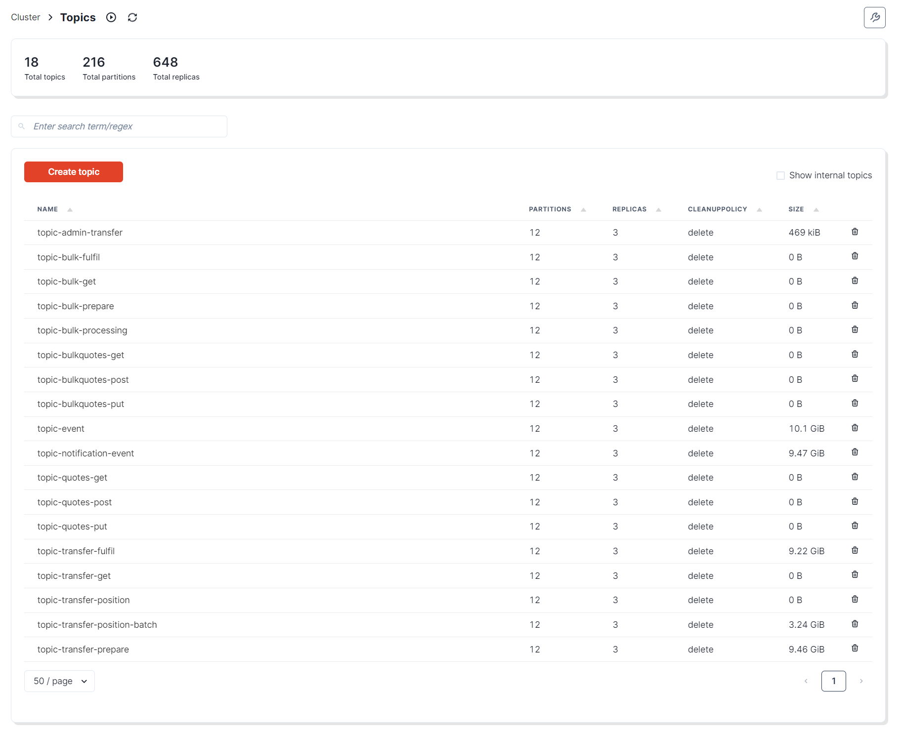
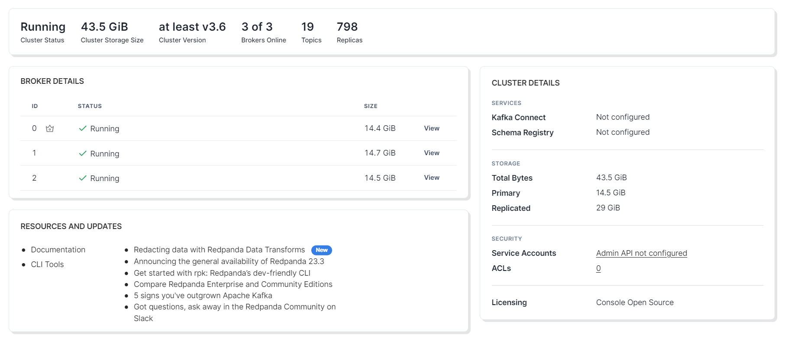
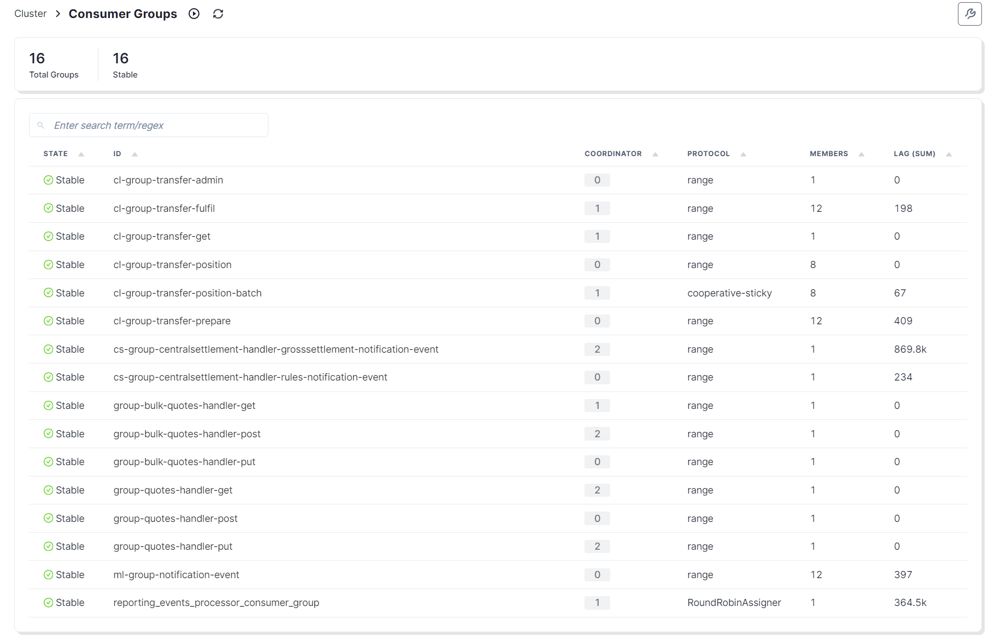
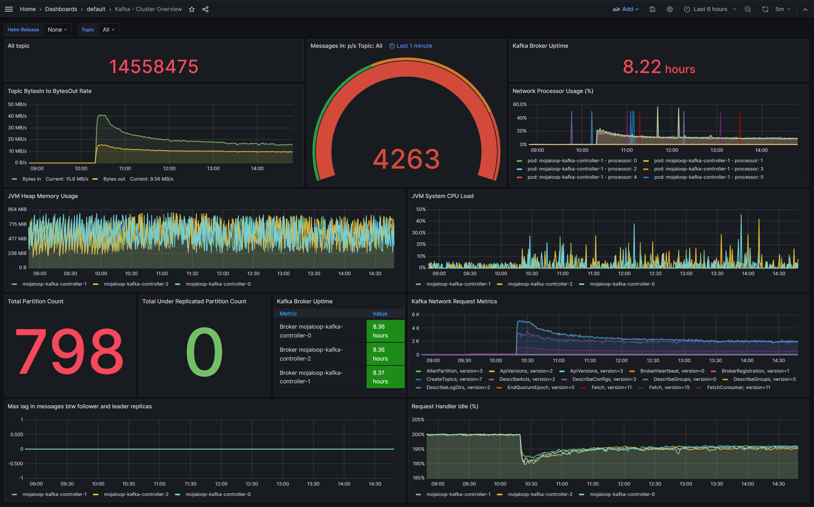
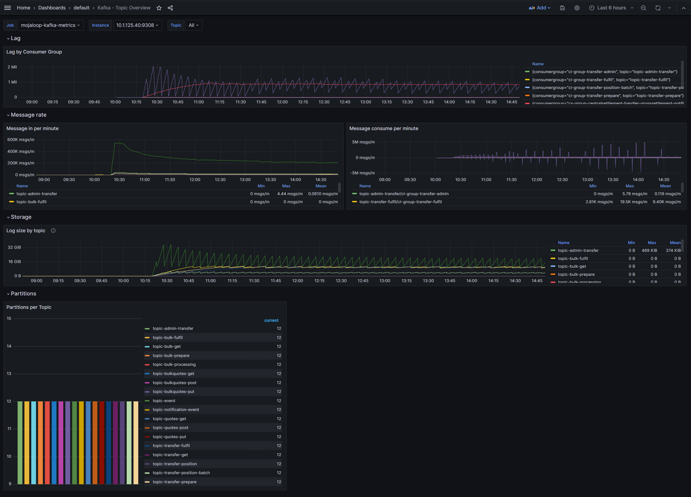
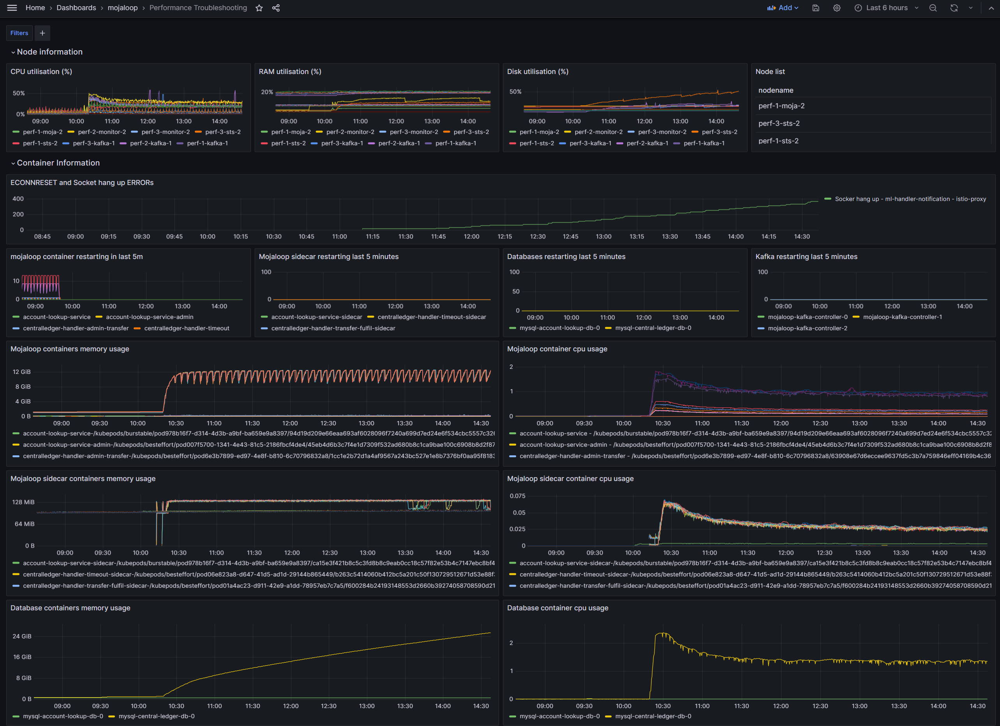
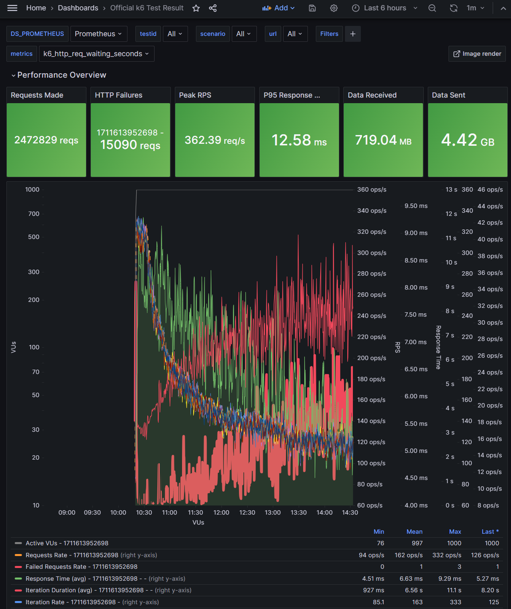
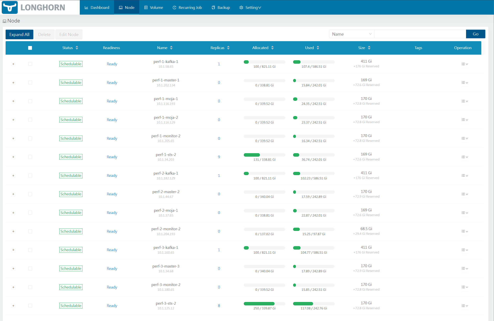
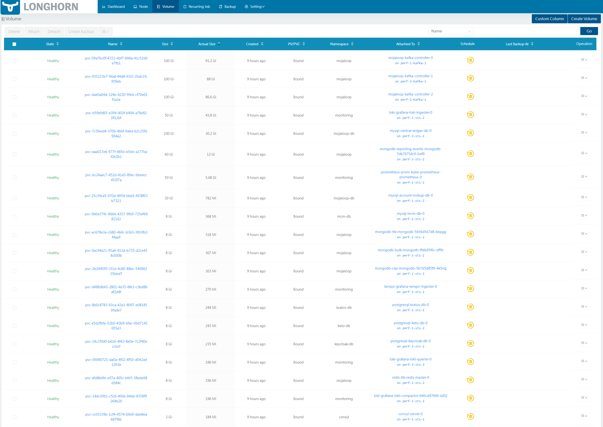

# Soak test

## After 4 hours

- 2.4 million transfers
- 121 transfers per second
- Kafka topics
  
- Kafka brokers
  
- Kafka consumers
  
- Kafka cluster overview
  
- Kafka topic overview
  
- Performance troubleshooting dashboard
  
- K6 dashboard
  
- Longhorn nodes
  
- Longhorn volumes
  
- Config canges
  
